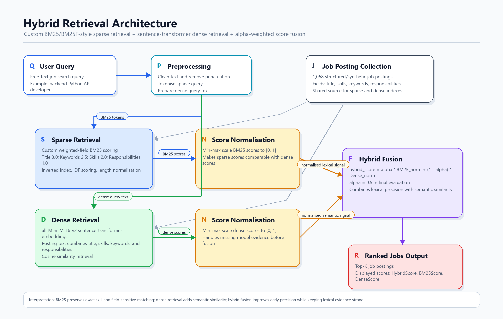
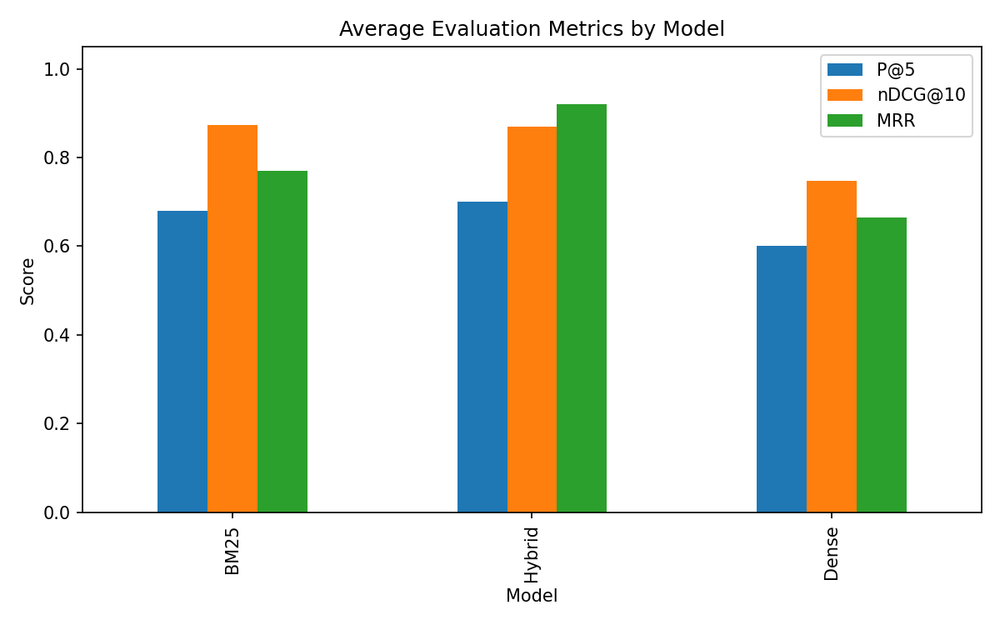
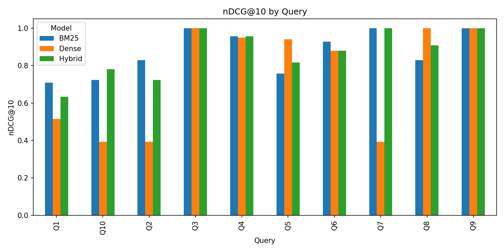

# Hybrid Job Search Engine: BM25 + Dense Retrieval

A Python information retrieval system for ranking job postings using custom BM25/BM25F-style weighted-field scoring, sentence-transformer embeddings, and hybrid score fusion.

## Why this project matters

Job search is vulnerable to lexical mismatch: a candidate might search for "backend Python API developer" while a relevant posting uses terms like "server-side engineer", "REST services", or "Django". Pure keyword retrieval is strong for exact skills and technologies, but it can miss semantically related wording. Dense retrieval helps capture meaning beyond exact token overlap, while hybrid retrieval combines both signals to improve early precision without losing the reliability of lexical matching.

## Key Features

- Field-weighted BM25-style sparse retrieval
- Sentence-transformer dense retrieval
- Hybrid linear score fusion
- Manual relevance judgements
- IR evaluation with P@5, nDCG@10, and MRR
- Reproducible results saved to `results/`

## Repository Structure

```text
data/        Job posting dataset
src/         Retrieval and interactive search code
evaluation/  Queries, relevance judgements, and evaluation scripts
results/     Generated metrics and visualisations
reports/     Final portfolio report
```

## Methodology

The sparse retriever applies a custom BM25-style scoring approach over structured job fields, giving higher influence to fields such as titles, keywords, skills, and responsibilities. This helps preserve exact matching for important job-search terms such as programming languages, frameworks, and role names.

The dense retriever represents job postings and queries with sentence-transformer embeddings, then ranks postings by cosine similarity. This captures semantic similarity when relevant postings use different wording from the query.

The hybrid model combines normalized sparse and dense scores with linear fusion:

```text
hybrid_score = alpha * BM25 + (1 - alpha) * Dense
```

`alpha` is the BM25 weight. Higher `alpha` values place more emphasis on lexical matching; lower values place more emphasis on dense semantic similarity.



## Results

| Model | P@5 | nDCG@10 | MRR |
| --- | ---: | ---: | ---: |
| BM25 | 0.680 | 0.873 | 0.770 |
| Hybrid | 0.700 | 0.870 | 0.920 |
| Dense | 0.600 | 0.747 | 0.664 |

BM25 achieved the best average nDCG@10, while Hybrid achieved the best P@5 and MRR. Dense retrieval alone was weaker, likely because the embedding model was not domain fine-tuned. Overall, the results support the idea that hybrid retrieval can improve early precision while BM25 remains strong for skill-sensitive job search.





## Report

[Final portfolio report](reports/Hybrid_Job_Search_Engine_Portfolio_Report.pdf)

## How to Run

Create and activate a virtual environment:

```powershell
python -m venv .venv
.\.venv\Scripts\Activate.ps1
```

Install dependencies:

```powershell
python -m pip install --upgrade pip
python -m pip install -r requirements.txt
```

Run interactive search:

```powershell
python src/search.py
```

Run evaluation:

```powershell
python evaluation/evaluate_all_models.py
```

## Limitations

- Small manually judged query set
- Synthetic/structured dataset
- First run requires model download
- No domain fine-tuning

## Future Improvements

- Larger judgement set
- Cross-encoder reranking
- Domain fine-tuned embeddings
- Web interface
- Larger real-world job dataset

## Skills Demonstrated

Python, Information Retrieval, BM25, Dense Retrieval, Hybrid Search, Evaluation Metrics, Sentence Transformers, pandas, scikit-learn.
